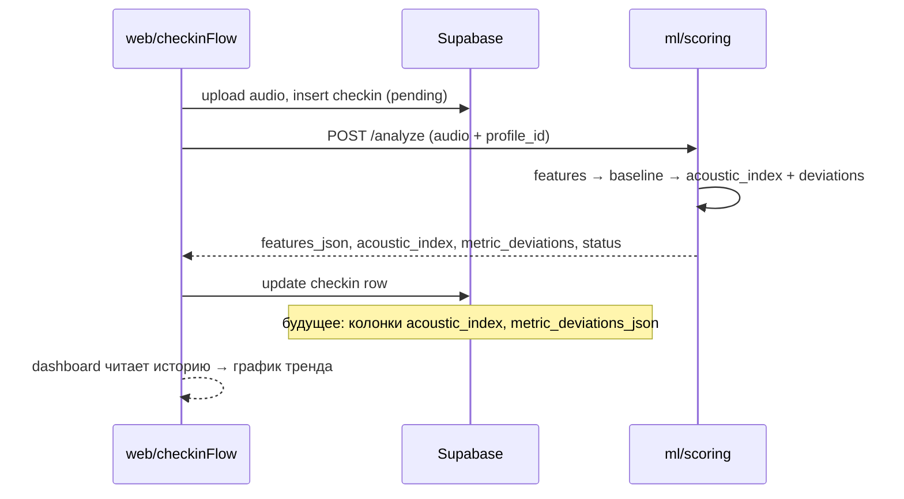

# Acoustic scoring: индекс, baseline и пайплайн

Документ фиксирует идею **безлимитного acoustic index**, калибровки baseline и отображения **абсолютного значения + % отклонения** в тренде. Это дополнение к [architecture.md](./architecture.md).

---

## Зачем отдельная метрика

| Проблема | Старый `vitality_score` (0–100) | Новый `acoustic_index` |
|----------|-----------------------------------|-------------------------|
| Потолок | Всегда ≤ 100 | **Без потолка** |
| Смысл 100 | «Идеально» | **= личный baseline** (норма человека) |
| Живой голос vs синтетика | Часто 100 (темп выше демо → штрафа нет) | Может быть **> 100** или **< 100** |
| Отклонение | Только «в худшую сторону» | **В обе стороны** (% от среднего) |
| Тренд на dashboard | Одна цифра 0–100 | Индекс по дням + Δ% по признакам |

`vitality_score` **остаётся** для обратной совместимости (mock seed, dashboard, SQL `CHECK ≤ 100`). На ML-тесте и в будущем тренде основная метрика — **acoustic_index**.

---

## Место в пайплайне

```text
Аудио (микрофон / WAV)
        │
        ▼
┌───────────────────┐
│  features.py      │  librosa: кадры RMS, pitch, onsets
│  extract_features │  → 5 скаляров (tempo, pause_mean, pitch_std, energy, duration)
│  extract_time_series │ → rms_envelope[], pitch_contour[] (опц., include_series=true)
└─────────┬─────────┘
          │
          ▼
┌───────────────────┐
│  baseline.py      │  Источник «нормы» (среднее):
│                   │  1) baseline_features в запросе (ML-тест, калибровка)
│                   │  2) Supabase: последние N чек-инов scenario_label=baseline
│                   │  3) sessionStorage personal baseline (web, /ml-demo)
└─────────┬─────────┘
          │
          ▼
┌───────────────────┐
│  scoring.py       │  • acoustic_index (без лимита, 100 = baseline)
│                   │  • metric_deviations (% Δ по каждому признаку, ±)
│                   │  • vitality_score (legacy, capped 0–100)
│                   │  • status, acoustic_delta (укр. текст для семьи)
└─────────┬─────────┘
          │
          ▼
┌───────────────────┐
│  summary.py       │  Короткое предложение (шаблон / OpenRouter)
└─────────┬─────────┘
          │
          ▼
┌───────────────────┐
│  api.py POST      │  JSON → web / Supabase checkins
│  /analyze         │
└─────────┬─────────┘
          │
    ┌─────┴─────┐
    ▼           ▼
/ml-demo     /dashboard
графики      тренд (пока vitality_score;
Δ%, index    позже acoustic_index)
```

### Последовательность чек-іна (прод)



---

## Какие признаки реально разделяют живой голос

По замерам на реальном микрофоне (один и тот же человек):

| Признак | Уставший | Бодрый | Нормальный | Разделяет? |
|---------|----------|--------|------------|------------|
| **tempo_bpm** | ~203–215 | ~348 | ~318 | ✅ да |
| **pause_mean_ms** | ~237–454 | ~98 | ~213 | ✅ да (лучший для «грусти») |
| **energy_rms** | ~0.04–0.06 | ~0.087 | ~0.055 | ✅ да |
| **pitch_std_hz** | ~1225–1403 | ~1371 | ~1403 | ❌ почти нет (шум piptrack) |

**Вывод:** индекс строим только из **темп + паузы + энергия**. `pitch_std` остаётся в JSON для отладки, но не входит в acoustic index.

### Ожидаемый рейтинг (baseline = ваш бодрый запись)

| Запись | Acoustic index |
|--------|----------------|
| Бодрый (baseline) | **100** |
| Нормальный / бодрый | ~67–72 |
| Уставший | ~57–65 |
| Очень уставший / печальный | **~44** |

Без личного baseline (сравнение с синтетическим демо ~93 bpm) все записи дают индекс 240–390 — **это не про втомление**, а про «я говорю быстрее синтетики».

---

### Признаки (агрегаты из кадров librosa)

| Поле | Что это | Откуда |
|------|---------|--------|
| `tempo_bpm` | Темп речи (прокси) | onsets + rhythm.tempo |
| `pause_mean_ms` | **Средняя** длина пауз | кадры RMS &lt; порога |
| `pitch_std_hz` | **σ** высоты тона | piptrack по voiced-кадрам |
| `energy_rms` | Средняя громкость | mean(RMS) |
| `duration_sec` | Длина записи | — |

Под капотом — **все кадры**; в API отдаются и скаляры, и (опционально) кривые `series_json` для графиков.

### Acoustic index (100 = baseline)

Взвешенное среднее индексов по 4 признакам (`WEIGHTS` в `scoring.py`):

| Признак | Индекс компоненты | Логика |
|---------|-------------------|--------|
| tempo, pitch_std, energy | `100 × (сейчас / baseline)` | ниже baseline → index &lt; 100 |
| pause_mean_ms | `100 × (baseline / сейчас)` | длиннее паузы → index &lt; 100 |

**Нет** `min(100, …)` — бодрый голос быстрее baseline может дать **130+**.

### Отклонение в процентах (симметрично)

Для каждого признака:

```text
metric_deviations[key] = (сейчас − baseline) / baseline × 100
```

- **0%** — как baseline  
- **−39%** темп — медленнее  
- **+125%** паузы — длиннее паузы  

На UI (`AcousticAnalysisCharts`) — горизонтальные бары с центром **0%**, не 100%.

### Статус «Варто подзвонити»

Сейчас (временно, под калибровку):

```text
check-in needed  если:
  acoustic_index < ACOUSTIC_INDEX_ALERT_THRESHOLD  (сейчас 65)
  ИЛИ legacy vitality < 65
  ИЛИ |отклонение| ≥ 25% по любому признаку
```

После калибровки на реальных данных порог задаётся в `scoring.py` → `ACOUSTIC_INDEX_ALERT_THRESHOLD` (или per-profile в Supabase).

---

## Baseline: три уровня

| Уровень | Где | Когда |
|---------|-----|--------|
| **Демо** | `DEMO_BASELINE` в `checkinFlow.ts` | Кнопки «Демо WAV» на `/ml-demo` |
| **Личный (сессия)** | `sessionStorage` / `personalBaseline.ts` | ML-тест: «Зберегти як мій baseline» |
| **Прод** | Supabase: среднее по `baseline` / rolling window чек-инов | Dashboard Марии после 7–10 «нормальных» дней |

Для **живого голоса** сравнение с синтетическим демо бессмысленно — сначала сохранить свой «бодрый» эталон, потом сравнивать уставший.

---

## Что уже в коде

| Компонент | Файл | Статус |
|-----------|------|--------|
| Acoustic index + deviations | `ml/hearbeat_ml/scoring.py` | ✅ |
| Time series (RMS, pitch) | `ml/hearbeat_ml/features.py`, `include_series` | ✅ |
| API поля | `acoustic_index`, `metric_deviations` в `POST /analyze` | ✅ |
| ML-тест UI | `/ml-demo`, personal baseline, графики Δ% | ✅ |
| Legacy vitality на dashboard | `VitalityChart`, `vitality_score` в БД | ✅ без изменений |
| Сохранение index в Supabase | `001_schema.sql` | ⏳ нет колонки |
| Тренд acoustic_index на dashboard | `VitalityChart` | ⏳ запланировано |
| Порог после калибровки | константа / env | ⏳ ждём замеры пользователя |

---

## Как встроится в dashboard (следующий шаг)

1. **Миграция SQL** (когда готовы):
   ```sql
   ALTER TABLE checkins ADD COLUMN acoustic_index NUMERIC(8, 2);
   ALTER TABLE checkins ADD COLUMN metric_deviations_json JSONB;
   ```
2. **checkinFlow.ts** — писать новые поля в `updateCheckIn`.
3. **VitalityChart** — линия `acoustic_index` по датам (ось Y без потолка 100).
4. **Карточка статуса** — показывать:
   - абсолютный index (например **87**);
   - подпись: «−13% от вашей нормы» (агрегат или главное отклонение из `metric_deviations`).
5. **Калибровка** — после серии записей зафиксировать `ACOUSTIC_INDEX_ALERT_THRESHOLD` (например: «при index &lt; 72 у Олега точно плохой день»).

---

## API-контракт (фрагмент ответа `/analyze`)

```json
{
  "features_json": {
    "tempo_bpm": 201.26,
    "pause_mean_ms": 265.97,
    "pitch_std_hz": 1373.4,
    "energy_rms": 0.0541,
    "duration_sec": 9.54
  },
  "acoustic_index": 70.2,
  "metric_deviations": {
    "tempo_bpm": -39.0,
    "pause_mean_ms": 124.5,
    "pitch_std_hz": 5.9,
    "energy_rms": -12.9
  },
  "vitality_score": 48.3,
  "status": "check-in needed",
  "acoustic_delta": "Темп мовлення нижчий на 39%; Паузи довші на 125%",
  "series_json": { "rms_envelope": [...], "pitch_contour": [...] }
}
```

---

## Принципы продукта (constitution)

- **Не медицина** — index и % отклонения это семейный сигнал, не диагноз.
- **Персональный baseline** — сравнение с собой вчера/на прошлой неделе, не с «нормой населения».
- **Тренд важнее одного дня** — один просадившийся чек-ін + стабильный тренд = разный UX (будущее).
- **Fallback** — если ML недоступен, `fallback_analysis.json` без `acoustic_index` (пока только legacy vitality).

---

## Связанные файлы

| Путь | Роль |
|------|------|
| `ml/hearbeat_ml/scoring.py` | Индекс, пороги, текст отклонений |
| `ml/hearbeat_ml/features.py` | Признаки и time series |
| `ml/hearbeat_ml/baseline.py` | Агрегация baseline из БД |
| `ml/hearbeat_ml/api.py` | HTTP-обёртка |
| `web/src/lib/personalBaseline.ts` | Baseline в браузере (ML-тест) |
| `web/src/lib/checkinFlow.ts` | Вызов `/analyze`, выбор baseline |
| `web/src/components/AcousticAnalysisCharts.tsx` | Графики Δ% и кривые |
| `web/src/pages/MlDemoPage.tsx` | Калибровка и демо |
| `specs/001-hearbeat-hackathon-mvp/data-model.md` | Модель checkins (обновить при миграции) |

---

## Чеклист калибровки (для команды / жюри)

1. Открыть `/ml-demo`, записать **бодрый** голос → **Зберегти як baseline** → index ≈ **100**.
2. Записать **уставший** → зафиксировать index и `metric_deviations`.
3. Записать **нейтральный** → сравнить с шагом 2.
4. Сообщить порог alert (например: «ниже **75** — звоню маме»).
5. Обновить `ACOUSTIC_INDEX_ALERT_THRESHOLD` в `scoring.py` или вынести в env `HEARBEAT_INDEX_ALERT_THRESHOLD`.
