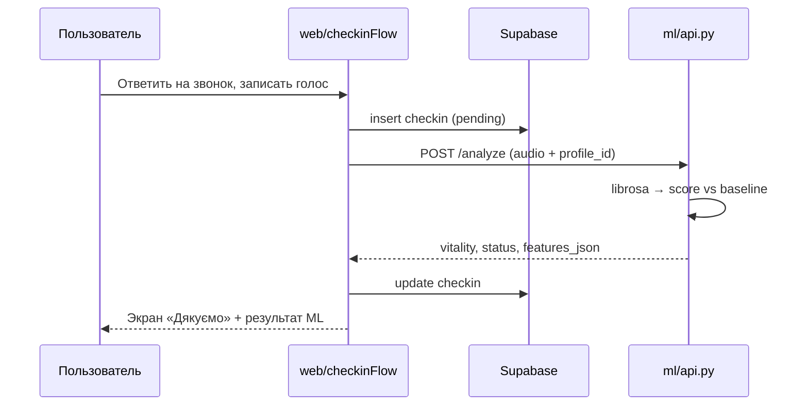
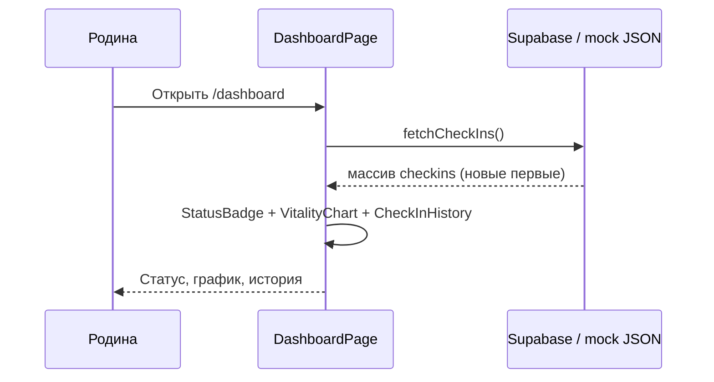

# Архитектура HearBeat

Кратко: **HearBeat — это не один проект, а три связанных сервиса** под одной папкой. Большинство файлов в репозитории — **не наш код**, а автоматически скачанные зависимости (`node_modules`, `.venv`).

---

## Зачем столько папок?

| Папка | Кто пишет | Зачем |
|-------|-----------|--------|
| `web/` | Frontend (React) | Сайт: чек-ін для бабуси, dashboard для родини |
| `ml/` | Backend ML (Python) | Анализ аудио: librosa → vitality, статус |
| `data/` | Данные и скрипты | SQL-схема, демо-WAV, генерация seed для Supabase |
| `docs/` | Документация | Этот файл и навигация |
| `specs/` (в корне репо) | Spec Kit | Требования, план, контракты — до кода |

Разделение сделано под хакатон: **веб**, **ML** и **данные** можно разрабатывать и деплоить отдельно.

---

## Что можно игнорировать (не наш код)

### `web/node_modules/` (~сотни мегабайт, тысячи файлов)

Создаётся командой `npm install`. Содержит **все npm-зависимости** из `web/package.json`:

- `react`, `react-dom` — UI
- `react-router-dom` — маршруты `/check-in`, `/dashboard`
- `recharts` — график тренда на dashboard
- `@supabase/supabase-js` — клиент базы данных
- `vite`, `typescript` — сборка и dev-сервер

**В git не попадает** (см. `web/.gitignore`). Удалить можно в любой момент: `rm -rf node_modules && npm install`.

Аналог в Python: `ml/.venv/` — виртуальное окружение с `librosa`, `fastapi` и т.д.

### Другие «шумные» артефакты

| Путь | Что это |
|------|---------|
| `web/dist/` | Собранный production-билд (`npm run build`) |
| `web/tsconfig.tsbuildinfo` | Кэш TypeScript |
| `web/package-lock.json` | Точные версии npm (нужен в git) |

---

## Наш код — что реально важно

```text
HearBeat/
├── docs/                          ← документация (вы здесь)
├── README.md                      ← как запустить
│
├── web/                           ← FRONTEND (~25 исходных файлов)
│   ├── public/                    статика без сборки
│   │   ├── mock-checkins.json     история чек-инов для mock-режима
│   │   ├── fallback_analysis.json ответ ML, если API недоступен
│   │   └── demo-audio/*.wav       демо-голос «норма» / «усталость»
│   ├── src/
│   │   ├── pages/
│   │   │   ├── CheckInPage.tsx    экран звонка + 3 вопроса
│   │   │   └── DashboardPage.tsx  dashboard родини
│   │   ├── components/            UI-блоки (звонок, график, бейдж)
│   │   ├── lib/
│   │   │   ├── checkinFlow.ts     оркестрация: запись → ML → сохранение
│   │   │   ├── supabase.ts        чтение/запись checkins (+ mock)
│   │   │   └── audioRecorder.ts   запись с микрофона
│   │   ├── types/checkin.ts       TypeScript-типы
│   │   ├── App.tsx                роутинг + навигация
│   │   └── main.tsx               точка входа React
│   ├── .env                       локальные переменные (не в git)
│   └── package.json               список npm-зависимостей
│
├── ml/                            ← ML API (~10 исходных файлов)
│   ├── hearbeat_ml/
│   │   ├── features.py            librosa: tempo, паузы, pitch, energy
│   │   ├── baseline.py            среднее по прошлым чек-инам
│   │   ├── scoring.py             vitality_score, status, текст отклонения
│   │   ├── summary.py             текст для семьи (шаблон / OpenRouter)
│   │   ├── api.py                 FastAPI: POST /analyze, GET /health
│   │   └── supabase_client.py     загрузка baseline из Supabase
│   ├── tests/test_scoring.py      тест: tired < normal
│   └── pyproject.toml             список Python-зависимостей
│
└── data/                          ← ДАННЫЕ И СКРИПТЫ
    ├── sql/                       схема Supabase + RLS
    ├── seed/                      JSON для сида
    ├── audio/demo/                исходные демо-WAV
    └── scripts/
        ├── generate_demo_audio.py TTS / синтетика
        ├── build_seed_json.py     mock-checkins.json
        └── seed_supabase.py       заливка в Supabase
```

**Итого «нашего» кода:** порядка **40–50 файлов**. Остальное — зависимости и артефакты сборки.

---

## Общая схема системы

```text
                    ┌─────────────────────────────────────┐
                    │           Браузер (React)            │
                    │  /check-in          /dashboard     │
                    └───────┬─────────────────┬───────────┘
                            │                 │
              запись аудио  │                 │  читает историю
                            ▼                 ▼
              ┌─────────────────┐   ┌─────────────────┐
              │  ML API :8000   │   │    Supabase     │
              │  FastAPI        │   │  PostgreSQL +   │
              │  librosa        │   │  Storage audio  │
              └────────┬────────┘   └────────┬────────┘
                       │                     │
                       │  vitality, status,    │  checkins
                       │  features_json      │  profiles
                       └──────────┬──────────┘
                                  │
                          результат пишется
                          обратно в checkins
```

### Роли компонентов

1. **Web** — только UI и оркестрация. Не считает акустику сам.
2. **ML API** — принимает WAV, возвращает JSON с признаками и оценкой.
3. **Supabase** — хранит профили, историю чек-инов, файлы аудио (в проде).

---

## Поток: новый чек-ін



Файл `web/src/lib/checkinFlow.ts` — **единая точка**, где склеивается весь flow.

---

## Поток: dashboard



---

## ML-пайплайн (что происходит внутри `/analyze`)

```text
WAV файл
   │
   ▼
features.py          tempo_bpm, pause_mean_ms, pitch_std_hz, energy_rms
   │
   ▼
baseline.py          среднее по 10 прошлым «нормальным» чек-инам
   │                 (из Supabase или baseline_features в запросе)
   ▼
scoring.py           acoustic_index (без стелі, 100=baseline), metric_deviations (±%)
   │                 vitality_score (legacy 0–100), status, acoustic_delta
   ▼
summary.py           короткое предложение для семьи (шаблон или LLM)
   │
   ▼
JSON ответ           см. docs/acoustic-scoring.md
```

Подробнее про индекс, калибровку и dashboard: [acoustic-scoring.md](./acoustic-scoring.md).

Контракт API: `specs/001-hearbeat-hackathon-mvp/contracts/ml-analyze-api.yaml`

---

## Режимы работы

### Mock-режим (сейчас у вас)

В `web/.env`:

```env
VITE_USE_MOCK=true
VITE_ML_API_URL=http://localhost:8000
```

| Часть | Поведение |
|-------|-----------|
| Dashboard | Читает `web/public/mock-checkins.json`, Supabase не нужен |
| Чек-ін → ML | **Живой** вызов `POST /analyze` (если ML API запущен) |
| Чек-ін → сохранение | В Supabase не пишет; результат виден на экране «Дякуємо» |
| ML недоступен | Подставляется `fallback_analysis.json` (заготовленные ответы) |

### Полный режим (с Supabase)

```env
VITE_USE_MOCK=false
VITE_SUPABASE_URL=...
VITE_SUPABASE_ANON_KEY=...
```

Плюс `ml/.env` с `SUPABASE_URL` и `SUPABASE_SERVICE_KEY` для baseline.

Тогда чек-ін **сохраняется** в БД, dashboard обновляется после refresh.

---

## Зависимости: зачем каждая

### Web (`package.json`)

| Пакет | Зачем в HearBeat |
|-------|------------------|
| react | Компоненты UI |
| react-router-dom | `/check-in`, `/dashboard` |
| recharts | График vitality по дням |
| @supabase/supabase-js | БД и storage |
| vite | Быстрый dev-сервер и сборка |

### ML (`pyproject.toml`)

| Пакет | Зачем в HearBeat |
|-------|------------------|
| fastapi + uvicorn | HTTP API |
| librosa + numpy | Извлечение акустических признаков |
| soundfile | Чтение WAV |
| supabase | Загрузка baseline из БД |
| httpx | Скачивание audio_url |
| pytest | Тесты scoring |

---

## Документация вне `HearBeat/`

Spec Kit хранит **требования и контракты** отдельно от кода:

```text
specs/001-hearbeat-hackathon-mvp/
├── spec.md           что должно работать (user stories)
├── plan.md           план и структура (источник для этого doc)
├── data-model.md     таблицы profiles, checkins
├── quickstart.md     сценарии проверки для жюри
└── contracts/        форматы API
```

`HearBeat/docs/` — **практическая** архитектура для разработчика.  
`specs/` — **продуктовая** спека для хакатона.

---

## Деплой (целевая картина)

| Компонент | Куда | Переменные |
|-----------|------|------------|
| `web/` | Vercel / Netlify / Lovable | `VITE_ML_API_URL`, Supabase keys |
| `ml/` | Railway / Render | `SUPABASE_*`, `OPENROUTER_API_KEY` (опц.) |
| Supabase | supabase.com | SQL из `data/sql/` |

`node_modules` и `.venv` на сервер **не заливаются** — зависимости ставятся при билде.

---

## Частые вопросы

**Почему не один монолит?**  
ML на Python (librosa), UI на TypeScript — разные стеки. API между ними проще для хакатона и демо.

**Можно ли удалить `data/scripts/`?**  
Для работы сайта — да. Нужны только если пересоздаёте seed или Supabase.

**Где менять тексты UI?**  
`web/src/pages/`, `web/src/components/`, `web/src/types/checkin.ts` (вопросы чек-ина).

**Где менять логику «устал / норма»?**  
`ml/hearbeat_ml/scoring.py` — пороги и веса признаков.

**Где порог «Варто подзвонити» на фронте?**  
Не на фронте — статус приходит из ML. Фронт только красит `status === 'check-in needed'`.
