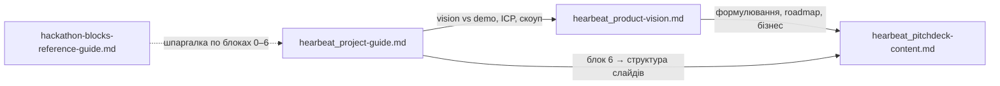

# Підготовка до Digital Future Hackathon

Робоча папка команди **HearBeat** — голосові чек-іни для сімей на відстані (ніша **Aging & Longevity**).

**Хакатон:** [Digital Future Hackathon](https://hackathon.lezo.io/) · 11–12 липня 2026 · онлайн, AI-first / no-code

**Стратегія команди:** «повна продуктова модель + мінімальне демо». На сцені — цільовий продукт; на екрані — доказ AI-core за вікенд.

---

## Файли в папці

| Файл | Призначення | Коли читати |
|---|---|---|
| [`hearbeat_project-guide.md`](hearbeat_project-guide.md) | **Головний робочий документ на 48 годин.** Тактичний гайд за блоками 0–6 методички: біль, ICP, скоуп, дані, промпти для Lovable/ML, архітектура, пітч, ролі, ризики | Старт хакатону і весь вікенд |
| [`hearbeat_product-vision.md`](hearbeat_product-vision.md) | **Повне продуктове бачення:** проблема, ICP, AI-core, «умний дзвінок», бізнес, roadmap 3–6 міс., відповіді на тестове завдання | До пітчу і для слайдів vision |
| [`hearbeat_pitchdeck-content.md`](hearbeat_pitchdeck-content.md) | **Контент пітчдеку** — 5 слайдів, спікерські нотатки, хронометраж 3 хв, Q&A | Збірка деки і репетиція |
| [`hackathon-blocks-reference-guide.md`](hackathon-blocks-reference-guide.md) | **Загальний довідник** по блоках методички та інструментах (не прив'язаний до HearBeat) | Шпаргалка в будь-який момент |

---

## З чого почати

```
1. hearbeat_project-guide.md     → що робимо за вікенд і як
2. hearbeat_product-vision.md    → навіщо продукт і куди росте
3. hearbeat_pitchdeck-content.md → як це розказати журі
4. hackathon-blocks-reference-guide.md → якщо потрібна підказка по блоку/інструменту
```

**Швидкий орієнтир за ролями:**

| Роль | Перші розділи |
|---|---|
| Product / пітч | `project-guide` блоки 1–2, 6 + `pitchdeck-content` |
| Web / Lovable | `project-guide` блоки 3–5 (бриф, промпти, стек) |
| ML | `project-guide` блок 4.3 + `product-vision` §7–8 |
| Усі | `project-guide` «North-star метрики» і «Критерій успіху MVP» |

---

## HearBeat в одному абзаці

**HearBeat** — сервіс турботливих голосових чек-інів для сімей на відстані. У літнього батька чи матері — простий сценарій «вхідний дзвінок»; після короткої розмови сервер аналізує голос і зміст. Доросла дитина бачить тренд самопочуття і сигнал «сьогодні краще подзвонити самому».

**AI-core (демо):** акустика + персональний baseline → `vitality_score` + семантичне summary.

**Vision (не в демо, але в презентації):** адаптивний «умний дзвінок», family prompt, мікро-утиліти в діалозі.

---

## Зв'язок між документами



- **`project-guide`** посилається на **`product-vision`** і **`hackathon-blocks-reference-guide`**
- **`pitchdeck-content`** зібраний з блоку 6 **`project-guide`** і формулювань **`product-vision`**

---

## Критерій успіху MVP (вікенд)

Один публічний сценарій без пояснень розробника:

```text
Відкрити лінк → відповісти на чек-ін → побачити оновлений dashboard →
зрозуміти, чому система радить «варто подзвонити».
```

**Обов'язкові артефакти здачі:** пітчдек PDF (≤5 слайдів), OnePager JPG 2400×3500, публічне посилання на демо (+ Loom як запасний варіант).

---

## Три шари продукту (не змішувати на пітчі)

| Шар | Що це | Пріоритет на хакатоні |
|---|---|---|
| **1. AI-core** | Акустика + baseline + тренд + сигнал для сім'ї | **Демо** |
| **2. «Умний дзвінок»** | Адаптивна бесіда, family prompt, календар | **Vision / Phase 1.5** |
| **3. Мікро-утиліта в розмові** | Рецепт, порада, тема про онука — всередині чек-іну | **Vision** |

**Формула пітчу:** «Ось як HearBeat виглядає в повноті → ось що ми вже зібрали за вікенд → ось наступні кроки.»

---

## Див. також

- [`../brainstorm/`](../brainstorm/) — ранній брейншторм, ідеї по інших нішах, умови хакатону
- [`../README.md`](../README.md) — огляд усього репозиторію
- [`../HearBeat/`](../HearBeat/) — код і реалізація (якщо є)
